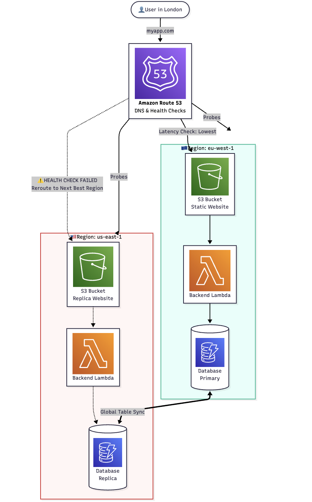

# Multi-Region-Active-Backend
A backend that survives an entire AWS region going down (e.g., "us-east-1 is down").

Suppose I have hosted a **website (static/dynamic) using S3** and am providing some kind of large data that i have stored either in **S3 or DynamoDB** at a single location and is replicated to other selected 3 regions. 

Now, people are **accessing my website to look up for data from multiple regions** that might not be even in the same country. So, **Route 53 will route them to the appropriate endpoint** based on their query. And if one region shuts down that will be verfied using Route 53 Health Check, it will route the websites going to other active regions.

#
**Flow**:

1. User in London types ```myapp.com```.

2. Route 53 checks latency: "London is closest to Ireland."

3. Route 53 checks health: "Is Ireland healthy? Yes." -> Routes to Ireland.

4. ***(Disaster happens: Ireland goes offline)***

5. Route 53 Health Check fails for Ireland.

6. User in London types ```myapp.com```.

7. Route 53: "Ireland is closest but Unhealthy. What's next best? Virginia." -> **Routes to Virginia**.

#
## Architecture
